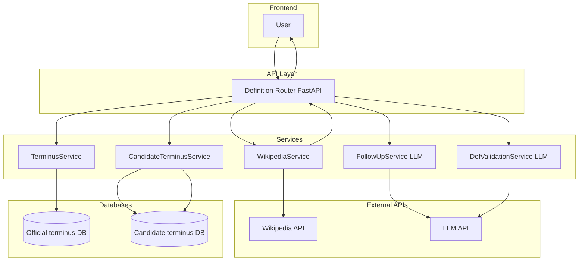

# AI-Powered Terminology Service

[](https://www.python.org/downloads/release/python-3120/)

A minuscule term

# TL;DR

AI-powered web service (built with FastAPI) that creates and manages a dictionary of financial terms. It automatically fetches definitions (primarily from Wikipedia with a user-defined topic-focused heuristics), uses Large Language Models (LLMs via litellm and instructor) to generate explanatory follow-up questions and validate definition accuracy, and can extract financial terms from text. New entries undergo a candidate review process before being added to the official terminus, ensuring quality control. The system uses SQLAlchemy for database persistence (defaulting to SQLite) and provides Docker support for easy deployment.

**Quick Start Commands**

- Run Locally (using Uvicorn):
(Ensure you have created a .env file with necessary configurations, like LLM API keys)

```bash
# Set up environment variables
export $(cat .env | xargs)
# Install dependencies (using uv is recommended)
uv sync
# Run the FastAPI application
uvicorn terminus.app:app --host 0.0.0.0 --port 8000 --reload
```
NB: Alternatively, use a .env loader (like python-dotenv) or export variables manually depending on your shell.


- Run with Docker Compose:
(Ensure you have created a .env file in the project root)

```bash
# Build and start the service defined in docker-compose.yml
docker-compose up --build -d
```

Access the API at http://localhost:8000/docs

**Table of Contents:**

- [AI-Powered Terminology Service](#ai-powered-terminology-service)
- [TL;DR](#tldr)
  - [1. Project Overview](#1-project-overview)
  - [2. Core Logic \& Workflow](#2-core-logic--workflow)
    - [Defining a Term (`/definition/{term}`)](#defining-a-term-definitionterm)
    - [Extracting Terms (`/terms/extract`)](#extracting-terms-termsextract)
    - [Candidate Management (`/candidate/`)](#candidate-management-candidate)
  - [3. Implementation Details](#3-implementation-details)
    - [Technology Stack](#technology-stack)
    - [Database](#database)
    - [API](#api)
    - [LLM Integration](#llm-integration)
    - [Wikipedia Integration](#wikipedia-integration)
    - [Configuration](#configuration)
    - [Containerization](#containerization)
  - [4. Architecture](#4-architecture)
    - [Layered Structure](#layered-structure)
    - [Asynchronous Processing](#asynchronous-processing)
  - [5. Guard Rails \& Quality Control](#5-guard-rails--quality-control)
  - [6. Self-Critique \& Potential Improvements](#6-self-critique--potential-improvements)
  - [7. Auto-Evaluation (Conceptual)](#7-auto-evaluation-conceptual)
  - [8. Setup \& Running](#8-setup--running)
    - [Prerequisites](#prerequisites)
    - [Environment Setup](#environment-setup)
    - [Installation](#installation)
    - [Running the Application (Locally)](#running-the-application-locally)
    - [Running with Docker](#running-with-docker)

---

## 1. Project Overview

The **terminus** project is an asynchronous web service designed to build, manage, and serve a curated dictionary of (financial and economic) terms. It leverages Large Language Models and Wikipedia to automatically generate, refine, and validate definitions and related concepts, ensuring a degree of quality control through a candidate review process.

**Core Objectives:**

*   Provide clear, concise, and factually validated definitions for financial terms.
*   Generate contextually relevant follow-up questions to deepen user understanding.
*   Identify and extract financial terms from unstructured text.
*   Implement a workflow for reviewing and approving automatically generated or externally sourced term definitions before they become part of the official terminus.
*   Offer a robust API for programmatic access to the terminus.

**Key Features:**

*   **Automated Definition Generation:** Utilizes Wikipedia and validate them using LLMs to source initial definitions.
*   **LLM-Powered Follow-up Generation:** Creates insightful follow-up questions based on the definition's content using `instructor` and `litellm`.
*   **LLM-Based Validation:** Use LLMs to critique the financial relevance of terms and validate the factual accuracy of definitions within a financial context.
*   **Candidate Workflow:** Implements a two-stage system (`candidate_terminus` and `terminus` tables) where new entries are held for review before being promoted to the official, validated terminus.
*   **Financial Term Extraction:** Identifies potential financial terms within a given text block using LLM-based Named Entity Recognition (NER) followed by a critique step.
*   **Asynchronous API:** Built with FastAPI for high-performance, non-blocking I/O operations.
*   **Database Persistence:** Uses SQLAlchemy for ORM and database interaction (defaulting to SQLite).
*   **Containerized Deployment:** Provides `Dockerfile` and `docker-compose.yml` for easy setup and deployment.


## 2. Core Logic & Workflow

The service operates primarily through API endpoints, orchestrating interactions between the database, LLM services, and the Wikipedia service.

### Defining a Term (`/definition/{term}`)

This is the primary user-facing endpoint for retrieving a term's definition. The logic follows a specific hierarchy to ensure quality and efficiency:

1.  **Check Official terminus:** The system first queries the `terminus` table (via `TerminusService`) for an existing, validated entry matching the requested `term` (case-insensitive). If found, this validated entry (`terminusAnswer`) is returned directly.
2.  **Check Candidate terminus:** If the term is not in the official terminus, the system checks the `candidate_terminus` table (via `CandidateTerminusService`).
    *   If a candidate entry exists, its details (`CandidateterminusAnswer`, including status like "under\_review" or "rejected") might be returned (the exact logic for returning candidates vs. generating new ones might need refinement based on desired UX).
3.  **Generate New Candidate (if necessary):** If the term is found in neither table, or if regeneration is triggered:
    *   **Fetch Definition:** The `WikipediaService` is queried asynchronously to find the most relevant, user-defined topic-focused (e.g. finance, physics) summary for the term. This service employs specific strategies:
        *   Searching for `"{term} (user-defined topic)"`.
        *   Standard Wikipedia search, prioritizing results containing financial keywords.
        *   Handling disambiguation pages by preferring user-defined topic)-related options.
        *   Falling back to a search including a context hint (`finance economics...`).
    *   **Generate Follow-ups:** The fetched definition (or potentially a user-provided one via `terminusEntryCreate`) is passed to the `FUService` (LLM). This service uses a specific prompt (`FOLLOWUP_SYSTEM_MESSAGE`, `FOLLOWUP_USER_MESSAGE_TEMPLATE`) and the `terminusAnswer` Pydantic model (via `instructor`) to generate a list of `FollowUp` questions based on sub-terms found within the definition.
    *   **Definition Validation:** Includes a `DefinitionValidationService`. This service is intended to be called here or before saving to candidates, using its specific LLM prompt (`VALIDATION_SYSTEM_MESSAGE`, `VALIDATION_USER_MESSAGE_TEMPLATE`) and the `DefinitionValidationResult` Pydantic model to assess the fetched/generated definition's factual accuracy and assign a confidence score.
    *   **Save as Candidate:** The term, fetched/generated definition, generated follow-ups, and initial status ("under\_review") are saved to the `candidate_terminus` table using `CandidateTerminusService`.
    *   **Return Candidate:** The newly created candidate entry details (`CandidateterminusAnswer`) are returned to the user.

### Extracting Terms (`/terms/extract`)

This endpoint identifies financial terms within a given block of text:

1.  **Initial Extraction:** The input text is passed to the `FinancialTermExtractionService`. A LLM call is made using a prompt focused on extracting *potential* financial/economic terms, structured according to the `ExtractedTerms` Pydantic model.
2.  **Critique/Validation:** Each extracted term is then individually subjected to a *second* LLM call within the same service (`_critique_term` method). This step uses a different prompt (`critique_system_message`, `critique_user_message_template`) and the `TermCritique` Pydantic model. The LLM acts as a domain expert to determine if the term is genuinely relevant to the user-defined topic.
3.  **Return Validated Terms:** Only the terms that pass the critique step (i.e., `is_relevant` is true in the `TermCritique` response) are returned to the user as a list of strings.

### Candidate Management (`/candidate/`)

These endpoints facilitate the review workflow:

*   **Get Candidate (`/candidate/{term}`):** Retrieves the details of a specific candidate entry (`CandidateterminusAnswer`) from the `candidate_terminus` table.
*   **Validate Candidate (`/candidate/validate`):** This is the crucial human-in-the-loop or automated approval step.
    *   **Input:** Takes a `CandidateValidation` payload (term, approve flag, reason).
    *   **Logic:**
        *   If `approve` is `True`:
            1.  Retrieve the candidate entry data (`get_dict` from `CandidateTerminusService` is used here, likely to detach the object from the session before manipulating across services).
            2.  Save the data (term, definition, follow-ups) to the official `terminus` table using `TerminusService`.
            3.  Delete the entry from the `candidate_terminus` table using `CandidateTerminusService`.
        *   If `approve` is `False`:
            1.  Update the status of the entry in the `candidate_terminus` table to "rejected" along with the provided `reason` using `CandidateTerminusService.reject`.
    *   **Return:** Confirmation message.


## 3. Implementation Details

### Technology Stack

*   **Web Framework:** FastAPI (for asynchronous API development)
*   **Data Validation/Serialization:** Pydantic (used extensively for API models, LLM response structures, and settings)
*   **Database ORM:** SQLAlchemy (for defining models and interacting with the database)
*   **Database Driver (Default):** `sqlite-aiosqlite` (for async SQLite access)
*   **LLM Interaction:**
    *   `instructor`: For reliable structured output (Pydantic models) from LLMs.
    *   `litellm`: To interact with various LLM providers (e.g., Gemini via `gemini/gemini-2.0-flash`) through a unified interface.
*   **Wikipedia Access:** `wikipedia` library (wrapped for asynchronous execution).
*   **Configuration:** `pydantic-settings` (for managing settings via environment variables and `.env` files).
*   **Dependency Management:** `uv` (or `pip`) with `pyproject.toml` and `uv.lock`.
*   **Logging:** `loguru` (configured in `app.py`).
*   **Containerization:** Docker, Docker Compose.

### Database

*   **ORM:** SQLAlchemy Core and ORM features are used.
*   **Engine/Session:** `database.py` configures the asynchronous SQLAlchemy engine (`create_async_engine`) and session factory (`async_sessionmaker`). The `get_session` dependency provider ensures each API request gets a dedicated session that is closed afterward.
*   **Models:** Defined in `models.py`:
    *   `terminusEntry`: Represents validated entries in the `terminus` table (term [PK], definition, follow\_ups [JSON Text]).
    *   `CandidateterminusEntry`: Represents entries awaiting review in the `candidate_terminus` table (term [PK], definition, follow\_ups [JSON], status [String]).
*   **Storage:** Defaults to a persistent SQLite database (`./volumes/sqlite_data/terminus.db`) managed via Docker volumes. `DATABASE_URL` in `.env` can configure other SQLAlchemy-compatible databases.
*   **Schema Management:** `Base.metadata.create_all(bind=engine)` in `database.py` provides a basic mechanism for table creation during development. *Note: For production, a dedicated migration tool like Alembic is strongly recommended but not currently implemented.*
*   **Serialization:** Follow-up questions (`FollowUp` Pydantic models) are serialized to a JSON string for storage in the database (`_serialize_follow_ups`) and deserialized back into Pydantic objects upon retrieval (`_deserialize_follow_ups`) within the `TerminusService` and `CandidateTerminusService`.

### API

*   **Framework:** FastAPI.
*   **Structure:** Endpoints are organized into routers (`routers/candidate.py`, `routers/definition.py`, `routers/terms.py`) which are included in the main `app.py`.
*   **Asynchronicity:** Uses `async def` extensively for non-blocking request handling, essential for waiting on database, Wikipedia, and LLM I/O.
*   **Validation:** Pydantic models defined in `schemas.py` are used for automatic request body validation and response serialization. Type hints are used throughout for clarity and static analysis.
*   **Dependency Injection:** FastAPI's dependency injection system is used, notably for providing database sessions (`Depends(get_session)`). Services (`TerminusService`, `WikipediaService`, LLM services) are instantiated within endpoint functions, often receiving the injected session.
*   **Documentation:** Automatic interactive API documentation is available at `/docs` (Swagger UI) and `/redoc` (ReDoc) provided by FastAPI.

### LLM Integration

*   **Abstraction:** `litellm` provides a common interface (`acompletion`) to different LLM APIs (defaulting to `gemini/gemini-2.0-flash`).
*   **Structured Output:** `instructor.from_litellm(acompletion)` patches the LiteLLM client to enforce responses conforming to specified Pydantic models (`response_model` parameter in services). This significantly improves reliability.
*   **Service Layer:** Logic for interacting with LLMs is encapsulated in dedicated service classes (`services/llm_service.py`):
    *   `BaseLLMService`: Abstract base class handling client initialization, message formatting (`build_messages`), and basic error handling during the LLM call (`generate_response`).
    *   `FUService`: Generates `terminusAnswer` (specifically the `follow_ups` part) based on a term and definition.
    *   `DefinitionValidationService`: Generates `DefinitionValidationResult` to assess definition quality.
    *   `FinancialTermExtractionService`: Performs two-step extraction and critique using `ExtractedTerms` and `TermCritique` models.
*   **Prompt Engineering:** System and user message templates are stored centrally (`prompts.py`) and formatted within the respective services, clearly defining the LLM's task and context.

### Wikipedia Integration

*   **Service:** `WikipediaService` encapsulates all logic for fetching summaries.
*   **Asynchronicity:** The blocking `wikipedia` library calls (`wikipedia.summary`, `wikipedia.search`, `wikipedia.page`) are wrapped using `asyncio.to_thread` to avoid blocking the FastAPI event loop.
*   **Topic Focus:** Implements heuristics to prioritize user-defined topic-related articles:
    *   Checks for explicit `(user-defined topic)` suffix.
    *   Scans search results and disambiguation options for financial keywords using regex (`topic_pattern`).
    *   Uses a context hint in fallback searches.
*   **Error Handling:** Explicitly handles `wikipedia.exceptions.DisambiguationError` and `wikipedia.exceptions.PageError`.

### Configuration

*   **Mechanism:** Uses `pydantic-settings`. The `Settings` class in `config.py` defines expected configuration variables.
*   **Source:** Settings are loaded from environment variables or a `.env` file.
*   **Variables:**
    *   `DATABASE_URL`: SQLAlchemy database connection string (default: `sqlite+aiosqlite:///./volumes/sqlite_data/terminus.db`).
    *   `LOG_LEVEL`: Logging level for the application (default: `INFO`).
    *   `litellm` might require provider-specific API keys (e.g., `GEMINI_API_KEY`) set as environment variables depending on the chosen model.

### Containerization

*   **Dockerfile:** Defines the image for the Python application, including installing dependencies using `uv` and setting the entry point to run `uvicorn`.
*   **docker-compose.yml:** Orchestrates the application service (`terminus_app`) and potentially related services (though only the app is defined here). It maps ports (`8000:8000`), mounts the source code (`./:/app`), and defines a named volume (`sqlite_data`) to persist the SQLite database file outside the container filesystem. It also specifies the `.env` file for configuration.

---

## 4. Architecture

### Layered Structure

The application follows a standard layered architecture pattern:

1.  **Presentation Layer (API):** Handles HTTP requests, routes them to appropriate handlers, performs data validation (via Pydantic), and serializes responses. This is implemented using FastAPI Routers (`routers/`).
2.  **Service Layer (Business Logic):** Contains the core application logic, orchestrating tasks like database interaction, calling external services (LLM, Wikipedia), and implementing workflows (e.g., candidate validation). This is implemented in the `services/` directory (`TerminusService`, `CandidateTerminusService`, `WikipediaService`, LLM Services).
3.  **Data Access Layer:** Responsible for interacting with the database. This includes the SQLAlchemy models (`models.py`), database session management (`database.py`), and the ORM queries performed within the Service Layer.
4.  **External Services:** Integrations with third-party APIs (LLM providers via `litellm`, Wikipedia API via `wikipedia` library).

This separation promotes modularity, testability, and maintainability.



*Conceptual Diagram*, the sequence diagram wasn't readable enough.

### Asynchronous Processing

The entire application is built around Python's `asyncio` framework, facilitated by FastAPI:

*   API endpoints are defined with `async def`.
*   Database interactions use an asynchronous SQLAlchemy driver (`aiosqlite`) and `await`.
*   LLM calls via `litellm` (`acompletion`) are asynchronous.
*   Blocking Wikipedia calls are executed in separate threads using `asyncio.to_thread` to prevent blocking the main event loop.

This ensures the service can handle concurrent requests efficiently, especially when waiting for external I/O operations.


## 5. Guard Rails & Quality Control

Several mechanisms are implemented to ensure the quality, relevance, and accuracy of the terminus data:

1.  **Candidate Review Workflow:** The most significant guard rail. New or automatically generated entries *must* pass through the `candidate_terminus` table and require explicit approval (`/candidate/validate`) before being promoted to the official `terminus`. This allows for human oversight or more sophisticated automated checks.
2.  **LLM-Powered Term Relevance Critique:** The `FinancialTermExtractionService` doesn't just extract terms; it uses a secondary LLM call (`_critique_term`) specifically to validate whether an extracted term is genuinely related to the user-defined topic, reducing noise.
3.  **LLM-Powered Definition Validation:** The `DefinitionValidationService` uses an LLM prompt focused on factual accuracy within the financial domain, providing a structured assessment (`DefinitionValidationResult` including `is_valid`, `confidence`, `reasoning`) of generated or fetched definitions.
4.  **Structured LLM Output:** Using `instructor` forces LLM responses into predefined Pydantic models. This prevents malformed or unexpected free-form text, ensuring downstream code receives data in the expected format. If the LLM fails to conform, `instructor` typically raises an error or allows for retries (depending on configuration, though basic retry isn't explicitly shown here).
5.  **Wikipedia User-Defined Topic Prioritization:** The `WikipediaService` actively tries to find user-defined topic-specific articles, reducing the chance of retrieving definitions for unrelated concepts with the same name (e.g., "bond" the chemical vs. "bond" the financial instrument).
6.  **API Input/Output Validation:** Pydantic models used in FastAPI endpoints automatically validate incoming request data and ensure outgoing responses adhere to the defined schema.
7.  **Type Hinting:** Extensive use of Python type hints improves code clarity and allows for static analysis tools (like MyPy) to catch potential type errors early.
8.  **Logging:** Detailed logging (`loguru`) provides visibility into the system's operations, helping diagnose errors and understand decision-making processes (e.g., why a specific Wikipedia page was chosen).


## 6. Self-Critique & Potential Improvements

While functional, the current implementation has areas for improvement and inherent limitations:

*   **LLM Reliability:**
    *   **Hallucination/Accuracy:** LLMs can still generate plausible but incorrect information (hallucinations). The `DefinitionValidationService` mitigates but doesn't eliminate this risk. Confidence scores are subjective to the LLM's assessment.
    *   **Prompt Sensitivity:** The quality of LLM outputs (extraction, follow-ups, validation) is highly dependent on the specific prompts used and the chosen LLM model. Changes in models might require prompt adjustments.
    *   **Bias:** LLMs can inherit biases from their training data, potentially affecting definitions or follow-up questions.
*   **Wikipedia Service Limitations:**
    *   **Summarization Quality:** Wikipedia summaries (`sentences=2`) can sometimes be too brief, too complex, or miss crucial nuances.
    *   **Disambiguation Imperfection:** The user-defined topic keyword heuristic might fail for terms where the financial meaning isn't obvious from the title or for genuinely ambiguous cases.
    *   **Vandalism/Accuracy:** Wikipedia content itself can occasionally be inaccurate or subject to vandalism, although popular articles are generally well-maintained.
*   **Scalability:**
    *   **Database:** SQLite is simple for development but has limitations under high concurrent write loads. Migrating to PostgreSQL or another production-grade database would be necessary for scaling.
    *   **External API Dependencies:** Heavy reliance on external LLM and Wikipedia APIs introduces potential bottlenecks related to rate limits, latency, cost, and availability. Caching strategies could help.
*   **Validation Robustness:**
    *   The LLM-based validation is a good step, but could be enhanced (e.g., cross-referencing with multiple sources, more sophisticated fact-checking techniques, multi-agent debate).
    *   The current candidate approval is binary. A more granular review process might be needed.
*   **Cold Start Problem:** An empty terminus requires significant initial effort (manual or automated runs) to populate candidate terms and get them reviewed.
*   **Lack of UI:** The review process currently relies on direct API calls. A simple web interface for reviewers would significantly improve usability.
*   **Testing Coverage:** While the structure supports testing, comprehensive unit, integration, and end-to-end tests are crucial but not explicitly provided. Testing LLM interactions effectively requires specific strategies (mocking, snapshot testing, evaluation sets).
*   **Migration Management:** No database migration tool (like Alembic) is included, making schema changes in production environments risky. `create_all_tables` is unsuitable for production.
*   **Error Handling Granularity:** Some error handling could be more specific, providing clearer feedback to the user or client system about *why* an operation failed (e.g., LLM API key missing vs. content moderation block).


## 7. Auto-Evaluation (Conceptual)

While not fully implemented, the system could incorporate automated evaluation mechanisms:

1.  **Candidate Approval Rate:** Track the percentage of candidate terms that are approved versus rejected. A high rejection rate might indicate issues with the generation (Wikipedia fetch) or validation (LLM) steps.
2.  **LLM Validation Confidence Monitoring:** Analyze the average confidence scores provided by the `DefinitionValidationService`. Consistently low scores might signal problems with the definitions being generated or the validator LLM itself.
3.  **Semantic Similarity to Golden Set:** Maintain a "golden set" of high-quality, human-verified terms and definitions. Periodically, compare newly approved terminus entries against this set using semantic similarity metrics (e.g., sentence-transformer embeddings and cosine similarity) to detect semantic drift or quality degradation.
4.  **Consistency Checks:**
    *   Periodically re-run the `DefinitionValidationService` on existing *official* terminus entries to catch potential regressions or identify definitions that have become outdated.
    *   Check for contradictions between a term's definition and the definitions of its follow-up terms.
5.  **A/B Testing Prompts/Models:** Implement infrastructure to test different LLM prompts or models for generation, extraction, or validation tasks, comparing their performance based on metrics like approval rates, confidence scores, or semantic similarity scores.
6.  **User Feedback Loop:** If user interaction is added, incorporate feedback mechanisms (e.g., rating definitions, reporting errors) as a direct measure of quality.


## 8. Setup & Running

### Prerequisites

*   Python 3.13+
*   `uv` (recommended, high-performance Python package installer and resolver) or `pip`
*   Docker and Docker Compose (for containerized execution)
*   Access to an LLM API compatible with `litellm` (e.g., Google AI Studio for Gemini API key, free-tier is OK for testing).

### Environment Setup

1.  **Clone the Repository:**
    ```bash
    git clone <your-repository-url>
    cd terminus
    ```
2.  **Create `.env` File:** Create a file named `.env` in the project root directory and add the following, adjusting as needed:
    ```dotenv
    # .env
    DATABASE_URL=sqlite+aiosqlite:///./volumes/sqlite_data/terminus.db
    LOG_LEVEL=INFO

    # Add LLM API Key if required by litellm for your chosen provider
    # Example for Gemini:
    GEMINI_API_KEY=your_gemini_api_key_here

    # User defined topic and anchor list of keywords
    TOPIC_DOMAIN=finance
    TOPIC_KEYWORDS=["finance", "financial", "banking", "investment", "economic", "stock", "market", "derivative"]
    ```
    *Ensure `litellm` knows how to pick up the key, or configure it according to `litellm` documentation if necessary.*

### Installation

Using `uv` (recommended):
```bash
uv sync
```

**Note:** For production, implement and use a database migration tool like Alembic.

### Running the Application (Locally)

```bash
uvicorn terminus.app:app --host 0.0.0.0 --port 8000 --reload
```
*(The `--reload` flag is useful for development)*

The API documentation will be available at `http://localhost:8000/docs`.

### Running with Docker

This is the recommended way to run the application, especially for consistency across environments.

1.  **Build and Start Containers:**
    ```bash
    docker-compose up --build
    ```
    *(Use `-d` to run in detached mode)*
2.  **Accessing the Service:** The API will be available at `http://localhost:8000`. Documentation at `http://localhost:8000/docs`.
3.  **Stopping Containers:**
    ```bash
    docker-compose down
    ```
    *(Add `-v` to remove the named volume `sqlite_data` if you want to clear the database)*


